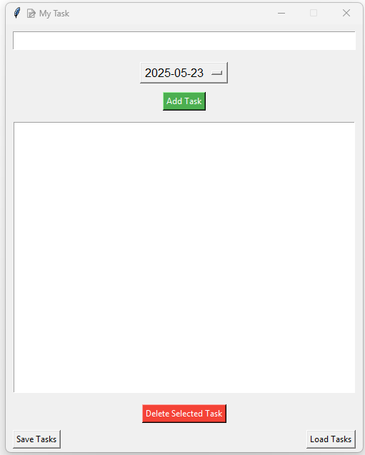
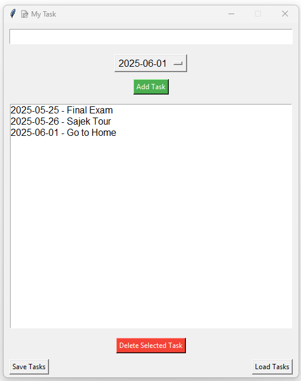

# 🗓️ My Task App (Python + Tkinter)

A simple, intuitive task management desktop application built with Python and Tkinter. This upgraded version allows users to assign a **date** to each task using a dropdown, defaulting to **today's date**. Tasks can be saved and loaded with their associated dates.

---

## ✅ Features

- 📝 Add tasks with an associated date
- 📅 Select a date from a dropdown (defaults to today)
- ❌ Delete selected tasks
- 💾 Save tasks (with dates) to a `.txt` file
- 📂 Load previously saved tasks
- 📜 Scrollable list display

---

## 📸 Screenshot

---

